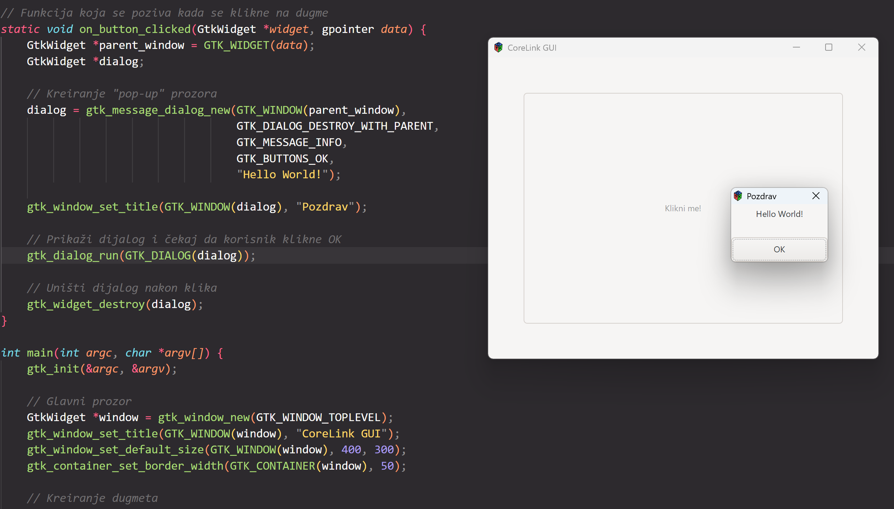

# 🖥️ CoreLink GUI: GTK+3 Primer u C-u

<p align="center">
  
  
  
</p>

Jednostavan i efikasan primer **GTK+ 3** aplikacije napisan u čistom **C jeziku**. Ovaj projekat služi kao polazna tačka za razumevanje *event-driven* programiranja i izradu native grafičkih interfejsa na Linux sistemima.

---

## 🖼️ Snimak ekrana
<p align="center">
  
  <br>
  <i>Prikaz CoreLink GUI aplikacije sa aktivnim dijalogom</i>
</p>

---

## ✨ Funkcionalnosti
* **Glavni prozor:** Desktop aplikacija sa precizno definisanim dimenzijama i paddingom.
* **Interaktivnost:** Implementacija `GtkButton` widget-a sa signal-callback mehanizmom.
* **Dijalozi:** Dinamičko pozivanje `GtkMessageDialog` prozora za interakciju sa korisnikom.
* **Native Lifecycle:** Pravilno rukovanje procesima i zatvaranje aplikacije na `destroy` signal.

---

## 📂 Struktura Projekta
```text
gtk3-c-primer/
├── gui.c          # Glavni izvorni fajl sa logikom
├── README.md      # Dokumentacija projekta
└── screenshot.png # Vizuelni prikaz (opciono)
```

## 🚀 Instalacija i Pokretanje
```text
sudo apt update
sudo apt install gcc pkg-config libgtk-3-dev
pkg-config --cflags --libs gtk+-3.0
gcc gui.c -o gui `pkg-config --cflags --libs gtk+-3.0`
./gui
```
