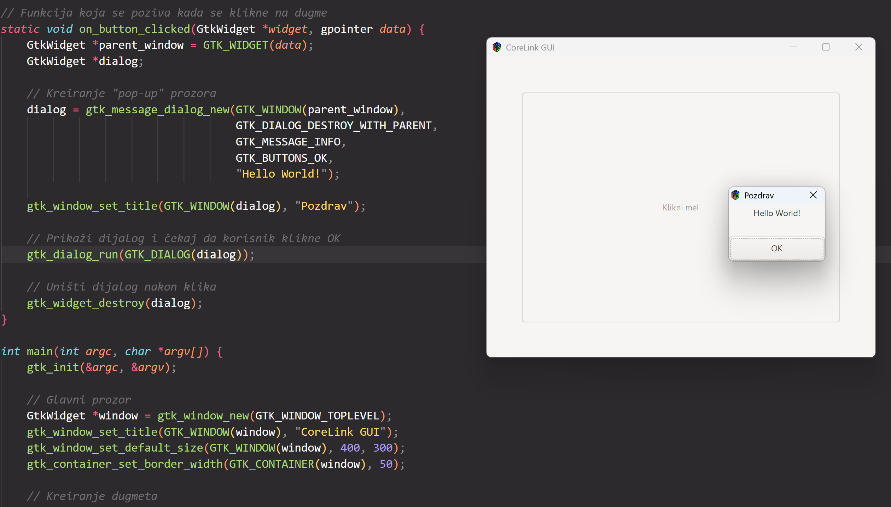

# 🖥️ CoreLink GUI: GTK+3 Primer in C

<p align="center">
  
  
  
</p>

A simple and efficient **GTK+ 3** application example written in pure **C**. This project serves as a starting point for understanding *event-driven* programming and building native graphical interfaces on Linux systems.

---

## 🖼️ Screenshot
<p align="center">
  
  <br>
  <i>Display of the CoreLink GUI application with an active dialog</i>
</p>

---

## ✨ Features
* **Main Window:** Desktop application with precisely defined dimensions and padding.
* **Interactivity:** Implementation of `GtkButton` widgets with signal-callback mechanisms.
* **Dialogs:** Dynamic invocation of `GtkMessageDialog` windows for user interaction.
* **Native Lifecycle:** Proper process handling and application termination on the `destroy` signal.

---

## 📂 Project Structure
```text
gtk3-c-primer/
├── gui.c          # Main source file with logic
├── README.md      # Project documentation
└── screenshot.png # Visual preview (optional)
# Update and install dependencies
sudo apt update
sudo apt install gcc pkg-config libgtk-3-dev

# Check GTK flags (optional)
pkg-config --cflags --libs gtk+-3.0

# Compile the project
gcc gui.c -o gui `pkg-config --cflags --libs gtk+-3.0`

# Run the application
./gui
